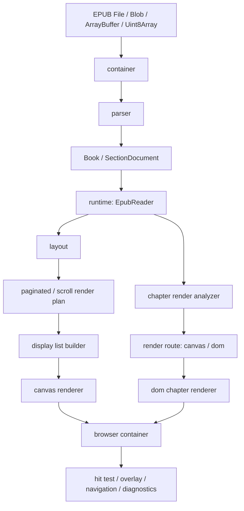

# pretext-epub 项目架构文档

## 1. 文档目标

本文档描述当前仓库的实际工程结构、核心模块边界和运行时职责，重点回答三个问题：

1. 这个仓库由哪些包和层次组成
2. EPUB 从输入到可阅读状态经过哪些核心模块
3. 阅读器运行时由谁编排，渲染和交互由谁负责

本文档面向继续维护 `pretext-epub` 的开发者，不讨论产品路线或未来规划，只描述当前代码已经形成的架构。

配套阅读：

- 渲染主链路见 [rendering-flow.md](./rendering-flow.md)

## 2. Monorepo 结构

仓库是一个 `pnpm` workspace，主要由两个 package 组成：

- `packages/core`
  - EPUB 容器读取、解析、统一内容模型、布局、阅读运行时、渲染器
  - 对外发布包：`@pretext-epub/core`
- `packages/demo`
  - 基于 `Vite + React` 的调试和演示宿主
  - 负责把 `EpubReader` 接到真实浏览器 UI

配套目录：

- `test-fixtures`
  - 测试 EPUB 样本、章节样本、快照说明
- `docs`
  - 当前仓库的开发文档和 QA 文档
- `docs-pretext-epub-20260414`
  - 更完整的需求、技术、任务拆分、能力矩阵文档

## 3. Core 包的分层

`packages/core/src` 基本按以下分层组织：

### 3.1 `container`

职责：

- 接收 EPUB 二进制输入
- 解压 ZIP 容器
- 按路径读取文本和二进制资源
- 统一资源路径和 MIME 处理

核心文件：

- `container/normalize-input.ts`
- `container/resource-container.ts`
- `container/resource-path.ts`
- `container/resource-mime.ts`

### 3.2 `parser`

职责：

- 解析 `container.xml`
- 解析 OPF 元数据、manifest、spine
- 解析 NAV / NCX 目录
- 解析章节 XHTML 和样式资源
- 输出统一 `Book` 与 `SectionDocument`

核心文件：

- `parser/book-parser.ts`
- `parser/container-parser.ts`
- `parser/opf-parser.ts`
- `parser/nav-parser.ts`
- `parser/ncx-parser.ts`
- `parser/spine-content-parser.ts`
- `parser/xhtml-parser.ts`
- `parser/css-resource-loader.ts`

### 3.3 `model`

职责：

- 定义阅读器统一领域类型
- 隔离 parser、runtime、renderer 之间的公共 contract

核心类型包括：

- `Book`
- `SectionDocument`
- `Locator`
- `ReaderPreferences`
- `SearchResult`
- `Bookmark`
- `Annotation`
- `RenderDiagnostics`

核心文件：

- `model/types.ts`

### 3.4 `layout`

职责：

- 将 `SectionDocument` 中适合文本布局的块交给 Pretext 处理
- 生成统一 `LayoutResult`
- 为后续分页和 canvas 渲染提供稳定输入

实现特点：

- 文本块和标题块进入 Pretext 布局
- 非文本块保留为 native block，并附带估算高度
- 输出 `locatorMap`，让渲染层和交互层能映射到阅读位置

核心文件：

- `layout/layout-engine.ts`

### 3.5 `runtime`

职责：

- 维护阅读器状态
- 编排打开、渲染、翻页、滚动、搜索、跳转、恢复位置
- 处理偏好、书签、批注、高亮、可访问性和诊断信息
- 决定章节应该走 `canvas` 还是 `dom`

这是整个内核的主编排层，中心对象是 `EpubReader`。

核心文件：

- `runtime/reader.ts`
- `runtime/locator.ts`
- `runtime/preferences.ts`
- `runtime/bookmark.ts`
- `runtime/annotation.ts`
- `runtime/search-results.ts`
- `runtime/chapter-render-analyzer.ts`
- `runtime/paginated-render-plan.ts`
- `runtime/scroll-render-plan.ts`
- `runtime/reading-language.ts`
- `runtime/reading-spread.ts`

### 3.6 `renderer`

职责：

- 把 runtime 产出的布局结果转成可见输出
- 提供 `canvas` 和 `dom` 两条渲染路径
- 提供 display list、交互区域、阅读样式 profile

核心文件：

- `renderer/display-list-builder.ts`
- `renderer/canvas-renderer.ts`
- `renderer/dom-chapter-renderer.ts`
- `renderer/draw-ops.ts`
- `renderer/reading-style-profile.ts`

## 4. 运行时中心：`EpubReader`

`EpubReader` 是当前内核的单一编排中心。

它持有并协调以下资源：

- `BookParser`
- `LayoutEngine`
- `DisplayListBuilder`
- `CanvasRenderer`
- `DomChapterRenderer`
- `ChapterRenderDecisionCache`
- `RenderableResourceManager`
- `DecorationManager`
- `ScrollCoordinator`

它内部维护的关键状态包括：

- 当前打开的 `book`
- 当前章节索引 `currentSectionIndex`
- 当前 `locator`
- 当前阅读模式 `scroll / paginated`
- 当前分页数据 `pages`
- 当前章节渲染决策
- 当前主题、排版、偏好
- 当前 decoration / annotation / selection 状态

从职责上看，`EpubReader` 不是单纯的“渲染器”，而是：

- 打开器
- 状态机
- 渲染编排器
- 交互路由器
- 诊断信息汇总器

## 5. 关键领域对象

### 5.1 `Book`

由 parser 产出，是整本书的统一表示，包含：

- `metadata`
- `manifest`
- `spine`
- `toc`
- `sections`

### 5.2 `SectionDocument`

表示一个章节或 spine item 的标准化内容。它是布局、分析、渲染决策和可访问性扫描的基础单位。

### 5.3 `Locator`

表示阅读器内部统一位置。TOC 跳转、搜索命中、书签恢复、批注恢复都围绕它工作。

### 5.4 `LayoutResult`

表示布局层输出，包含：

- 布局后的 block 列表
- 文本行信息
- native block 高度估计
- `locatorMap`

### 5.5 `SectionDisplayList`

表示 canvas 渲染的中间结果，包含：

- 绘制指令 `ops`
- 命中和交互区域 `interactions`
- section 尺寸信息

### 5.6 `ReaderPage`

分页模式下的叶子页模型，负责承接：

- 页码
- 章节内页码
- 所属 section
- 当前页承载的 block slice

## 6. 章节级混合渲染策略

这个项目当前不是“全 DOM”也不是“全 Canvas”，而是章节级路由：

- 简单、可控的 reflowable 章节优先走 `canvas`
- 固定版式、封面页、单图页强制走 `dom`
- 结构或样式复杂的章节通过 analyzer 评估后回退到 `dom`

章节渲染决策主要由两部分组成：

1. 显式规则
   - `pre-paginated`
   - `cover`
   - `image-page`
2. 分析器规则
   - 高风险标签
   - 复杂 CSS 信号
   - 深层嵌套
   - 图片密度
   - 大节点数
   - 复杂 inline style

这样做的目的不是追求单一路径统一，而是把复杂 EPUB 的成本明确地收敛到 `dom`，避免无限扩张 `canvas` 的兼容边界。

## 7. Demo 与 Core 的关系

`packages/demo` 不是第二套阅读器实现，而是 `EpubReader` 的浏览器宿主。

其核心控制层是：

- `packages/demo/src/use-reader-controller.ts`

它负责：

- 创建和销毁 `EpubReader`
- 把 React 状态与 reader 状态同步
- 调用 `open / render / next / prev / search / bookmark` 等 API
- 将 `RenderDiagnostics`、overlay、selection、bookmark 状态映射到 UI

因此：

- 产品逻辑主干在 `core`
- UI 和宿主交互在 `demo`

## 8. 测试架构

测试分三层：

### 8.1 Core 单元与集成测试

位于 `packages/core/test`，覆盖：

- parser 行为
- layout 行为
- runtime 行为
- hybrid render routing
- locator / bookmark / annotation

### 8.2 Demo 端到端测试

位于 `packages/demo/e2e`，覆盖：

- 打开 EPUB
- TOC 导航
- 搜索与跳转
- scroll / paginated 模式切换
- 书签恢复
- overlay 可视结果

### 8.3 测试样本

位于 `test-fixtures`，为 parser、compat、fallback、FXL smoke 提供可复用样本。

## 9. 当前架构的几个关键特点

### 9.1 单一编排中心

`EpubReader` 是当前唯一运行时权威入口，避免同一规则在 demo、renderer、parser 中多处散落。

### 9.2 中间层清晰

核心主链路有明确中间产物：

- `Book`
- `SharedChapterRenderInput`
- `LayoutResult`
- `SectionDisplayList`
- `ReaderPage`

这让调试和测试可以分别卡在不同层做验证。

### 9.3 渲染策略显式

`canvas` 和 `dom` 的差异没有被隐藏，而是显式暴露为：

- `ChapterRenderDecision`
- `RenderDiagnostics`
- `RenderBackendCapabilities`

### 9.4 宿主与内核分离

核心包不依赖 React；demo 只是宿主示例，不是内核的一部分。

## 10. 建议的阅读顺序

如果要从代码层面理解架构，建议按下面顺序阅读：

1. `packages/core/src/model/types.ts`
2. `packages/core/src/parser/book-parser.ts`
3. `packages/core/src/runtime/reader.ts`
4. `packages/core/src/layout/layout-engine.ts`
5. `packages/core/src/runtime/chapter-render-analyzer.ts`
6. `packages/core/src/runtime/paginated-render-plan.ts`
7. `packages/core/src/runtime/scroll-render-plan.ts`
8. `packages/core/src/renderer/display-list-builder.ts`
9. `packages/core/src/renderer/canvas-renderer.ts`
10. `packages/core/src/renderer/dom-chapter-renderer.ts`

## 11. 架构总览图

