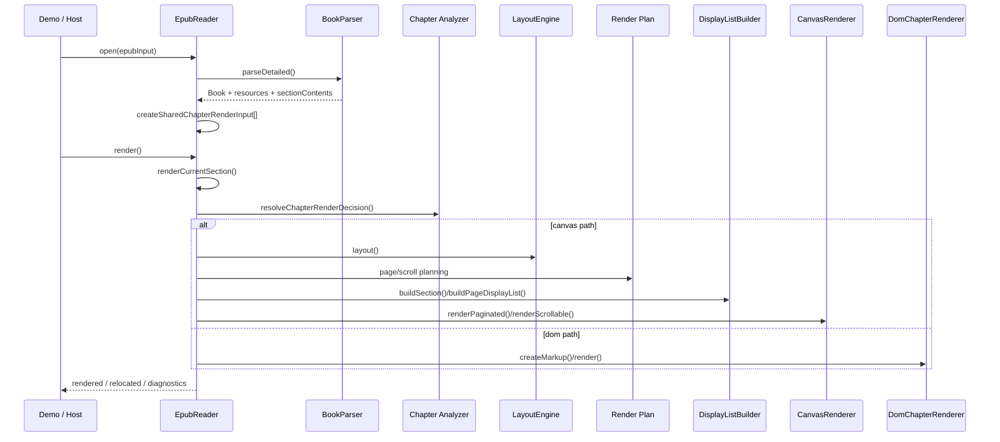

# pretext-epub 渲染流程文档

## 1. 文档目标

本文档只描述“渲染是怎么发生的”，即：

1. 一本 EPUB 从打开到第一次显示的主链路
2. `scroll` 和 `paginated` 两种模式下的差异
3. `canvas` 与 `dom` 两条渲染路径如何被选择和执行

本文档默认以 `packages/core/src/runtime/reader.ts` 为主线。

配套阅读：

- 模块边界和职责见 [project-architecture.md](./project-architecture.md)

## 2. 渲染主链路总览

渲染入口由 `EpubReader` 提供：

- `open(input)`
- `render()`
- `goToLocation(locator)`
- `next() / prev()`
- `setTheme() / setTypography() / submitPreferences()`

这些入口最终都会走到内部的 `renderCurrentSection()`。

总流程如下：



## 3. 打开阶段：从输入到可渲染章节

### 3.1 输入标准化

`open(input)` 首先调用 `normalizeEpubInput()`，支持：

- `File`
- `Blob`
- `ArrayBuffer`
- `Uint8Array`

目标是统一得到 `Uint8Array`。

### 3.2 容器与包解析

接下来 `BookParser.parseDetailed()` 完成：

1. 解压 EPUB ZIP
2. 读取 `META-INF/container.xml`
3. 定位 OPF
4. 解析 metadata / manifest / spine
5. 解析 NAV 或 NCX
6. 读取每个 spine item 的 XHTML 和关联样式表
7. 生成 `Book`

### 3.3 构建共享章节输入

`open()` 在 parser 输出之上，进一步构建 `chapterRenderInputs`：

- 每个章节保留原始内容 `content`
- 生成预处理结果 `preprocessed`
- 保留 `linkedStyleSheets`

这里的设计意图是让后续多个阶段共享同一份章节标准化结果：

- 章节复杂度分析
- DOM 渲染输入
- 某些运行时辅助逻辑

## 4. 渲染入口：`renderCurrentSection()`

几乎所有可见更新都会进入 `renderCurrentSection(renderBehavior)`。

它负责：

1. 处理 preserve / relocate 两种渲染行为
2. 取出当前章节
3. 计算章节渲染决策
4. 根据阅读模式进入分页或滚动路径
5. 在渲染后同步 locator、当前页号和可见状态

其中：

- `relocate`
  - 表示这次渲染应把视图定位到当前 `locator`
- `preserve`
  - 表示主题变化、批注变化、重排等情况下尽量保持当前可见锚点

## 5. 章节渲染决策：`canvas` 还是 `dom`

### 5.1 强制走 DOM 的情况

`resolveChapterRenderDecision()` 先处理显式规则：

- `pre-paginated`
- `cover`
- `image-page`

这些章节直接返回 `mode: "dom"`。

### 5.2 分析器路由

其他章节进入 `chapter-render-analyzer`：

- 统计标签数量
- 统计复杂样式信号
- 统计节点深度和节点数
- 统计图片密度
- 统计 inline style 复杂度

根据总分决定：

- 分数低于阈值：`canvas`
- 分数达到阈值：`dom`

### 5.3 决策缓存

渲染决策按章节源码缓存。这样在反复翻页、搜索、切换模式时，不需要重复分析同一章节。

## 6. 分页模式渲染流程

分页模式下，`renderCurrentSection()` 的主链路如下：

```text
section
  -> 计算分页视口尺寸
  -> 如果不是 pre-paginated，则 layout()
  -> ensurePages()
  -> 解析当前页或当前 spread
  -> 根据 render decision 进入 canvas 或 dom
  -> 同步 pageNumber 与 locator
```

### 6.1 分页数据生成

`ensurePages()` 最终依赖 `buildPaginatedPages()`：

- 遍历所有章节
- 对当前章节复用已计算好的 `LayoutResult`
- 对文本块按行切页
- 对 native block 按估算高度切页
- 生成 `ReaderPage[]`

分页模型的核心是“叶子页”：

- 每个 `ReaderPage` 对应一个可定位的页面实体
- spread 只是叶子页的视图组合，不是另一套独立分页数据

### 6.2 分页 + Canvas

如果章节走 `canvas`：

1. 从 `ReaderPage` 取出当前页承载的 block slice
2. 用 `buildPageDisplayList()` 生成当前页的 display list
3. 交给 `CanvasRenderer.renderPaginated()`

`CanvasRenderer.renderPaginated()` 会：

- 清空容器
- 准备 canvas
- 绘制 draw ops
- 生成 text layer

### 6.3 分页 + DOM

如果章节走 `dom`：

1. 根据当前页或当前 spread 确定需要展示的 section
2. 构造 `DomChapterRenderInput`
3. 由 `DomChapterRenderer` 生成 markup
4. 浏览器负责最终布局和测量
5. runtime 再把测量结果同步回页码和 locator

### 6.4 Synthetic Spread

分页模式下，如果当前章节是固定版式，且满足 spread 条件：

- `resolveReadingSpreadContext()` 会开启 synthetic spread
- 渲染时可能一次显示左右两个 viewport slot
- `next()/prev()` 按 spread 前进，而不是按单个 leaf page 前进

## 7. 滚动模式渲染流程

滚动模式的关键目标不是“一次把整本书全量画出来”，而是：

- 保持连续滚动体验
- 控制重排和重绘范围
- 允许 `canvas` 和 `dom` 章节混合共存

主链路如下：

```text
updateScrollWindowBounds()
  -> buildScrollRenderPlan()
  -> canvas/dom section assembly
  -> CanvasRenderer.renderScrollable()
  -> scrollToCurrentLocation() or restoreScrollAnchor()
  -> sync position from scroll
```

### 7.1 Scroll Window

`EpubReader` 用 `scrollWindowStart / scrollWindowEnd` 表示当前激活的章节窗口。

窗口外章节不会做完整 layout/render，而是保留高度占位，保证滚动几何稳定。

### 7.2 Scroll Render Plan

`buildScrollRenderPlan()` 会按章节生成 `sectionsToRender`：

- 窗口外章节：只保留高度占位
- 窗口内 DOM 章节：保留估算高度，并生成 `domHtml`
- 窗口内 Canvas 章节：
  - layout
  - display list
  - measured height

### 7.3 Scroll Slice

Canvas 章节不会总是整章重绘，而是基于 viewport 计算 slice window：

- 当前可见窗口
- 上一个相邻窗口
- 下一个相邻窗口

这样可以：

- 降低快速滚动时的空白闪烁
- 避免整个大章节全量重绘

### 7.4 Scrollable Canvas Renderer

`CanvasRenderer.renderScrollable()` 会对每个 section 做三种处理：

- `domHtml` 存在：渲染为 DOM section
- `displayList` 不存在：渲染为 virtual placeholder
- `displayList` 存在：渲染为一个或多个 canvas slice

这一层是混合渲染在滚动模式下真正落地的地方。

## 8. Canvas 路径的内部流程

Canvas 路径基本是三段式：

```text
SectionDocument
  -> LayoutEngine
  -> DisplayListBuilder
  -> CanvasRenderer
```

### 8.1 `LayoutEngine`

职责：

- 将文本块交给 Pretext 进行行布局
- 给 native block 估算高度
- 生成 `locatorMap`

输出是 `LayoutResult`。

### 8.2 `DisplayListBuilder`

职责：

- 把 `LayoutResult` 转换为 draw ops
- 生成文本、背景、图片、强调、高亮等绘制指令
- 生成命中与交互区域

输出是 `SectionDisplayList`。

### 8.3 `CanvasRenderer`

职责：

- 创建或复用 canvas
- 准备像素尺寸
- 执行 draw ops
- 为文本生成 text layer
- 维护 section / slice 对应的 DOM 包装结构

## 9. DOM 路径的内部流程

DOM 路径的核心目标是：

- 保留复杂结构和复杂样式的浏览器布局能力
- 继续纳入统一的 runtime 管理

主链路如下：

```text
SharedChapterRenderInput
  -> createDomRenderInput()
  -> DomChapterRenderer.createMarkup()
  -> container.innerHTML / browser layout
  -> runtime geometry + interaction sync
```

`DomChapterRenderer` 会做几件事：

- 注入 linked stylesheets
- 注入阅读器 normalization CSS
- 对内联样式和样式表做作用域约束
- 输出章节 DOM 结构
- 在 cover / image-page / FXL 情况下输出专门 markup

## 10. 渲染后的同步步骤

无论最终走 `canvas` 还是 `dom`，渲染后还会进入一组统一同步步骤：

- 更新 `currentPageNumber`
- 更新 `locator`
- 更新 `RenderDiagnostics`
- 更新 `VisibleSectionDiagnostics`
- 更新可见边界与交互区域
- 同步 selection / annotation / search overlay

也就是说，渲染器只是输出层，阅读器真正对外承诺的是 runtime 状态。

## 11. 交互与渲染的耦合点

### 11.1 定位恢复

`restoreLocation()` 先解析和降级 locator，再执行实际跳转。

### 11.2 搜索

搜索以 section 为单位构建结果，结果最终仍然通过 `locator` 回到统一跳转链路。

### 11.3 高亮与批注

高亮和批注不会直接改写正文，而是进入：

- decoration
- annotation
- overlay

然后在 `canvas` 或 `dom` 渲染路径中分别体现。

### 11.4 命中测试

两条路径的交互来源不同：

- `canvas`：基于 interaction map / hit test
- `dom`：基于 DOM geometry / DOM events

但它们在 runtime 上会被收敛成统一定位和事件语义。

## 12. 渲染诊断模型

当前仓库对渲染并不是“黑盒输出”，而是显式暴露了诊断信息：

- 当前 backend：`canvas` / `dom`
- 当前章节复杂度分数
- 路由原因
- layout authority
- geometry source
- interaction model
- flow model
- spread 信息

这让 demo 可以直接展示：

- 为什么这个章节走 DOM
- 当前是分页还是滚动
- 当前是否激活 spread
- 当前章节的能力边界是什么

## 13. 调试渲染问题时的推荐切入点

按问题类型可优先查看：

- 打不开书：`container/*`、`parser/book-parser.ts`
- 目录/章节异常：`opf-parser.ts`、`nav-parser.ts`、`spine-content-parser.ts`
- Canvas 文本/图片布局问题：`layout/layout-engine.ts`、`renderer/display-list-builder.ts`
- 为什么回退 DOM：`runtime/chapter-analysis-input.ts`、`runtime/chapter-render-analyzer.ts`
- 分页不对：`runtime/paginated-render-plan.ts`
- 滚动窗口化异常：`runtime/scroll-render-plan.ts`
- DOM 呈现异常：`renderer/dom-chapter-renderer.ts`
- 跳转/恢复位置异常：`runtime/locator.ts`、`runtime/reader.ts`

## 14. 渲染流程总览图

```mermaid
flowchart TD
  A[open()] --> B[normalizeEpubInput]
  B --> C[BookParser.parseDetailed]
  C --> D[Book + sectionContents]
  D --> E[createSharedChapterRenderInput]
  E --> F[render()]
  F --> G[renderCurrentSection()]
  G --> H{mode}
  H -->|paginated| I[ensurePages]
  H -->|scroll| J[buildScrollRenderPlan]
  G --> K[resolveChapterRenderDecision]
  K -->|canvas| L[LayoutEngine]
  L --> M[DisplayListBuilder]
  M --> N[CanvasRenderer]
  K -->|dom| O[DomChapterRenderer]
  I --> N
  J --> N
  N --> P[sync locator/page/diagnostics]
  O --> P
```
